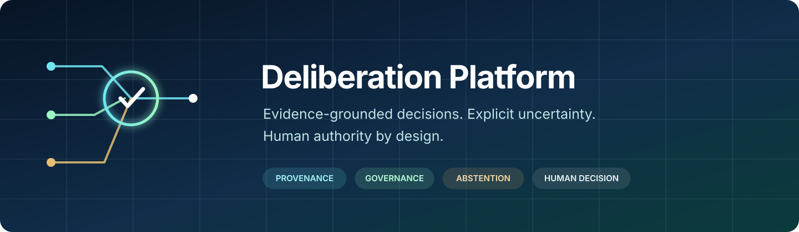
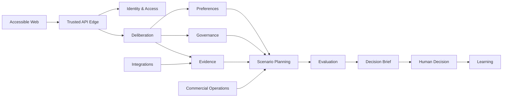

<p align="center">
  
</p>

<p align="center">
  <strong>Evidence-grounded decision infrastructure for consequential choices.</strong>
</p>

<p align="center">
  TypeScript · Domain-Driven Design · PostgreSQL · Kubernetes · OpenTelemetry
</p>

---

## Overview

Deliberation Platform is a human-authority decision laboratory for organizations that need to explore options, test assumptions, evaluate trade-offs, and preserve an auditable chain of evidence without delegating the final decision to an AI system.

The platform models generated scenarios as hypotheses, keeps facts and inferences visibly distinct, preserves stakeholder disagreement, and supports explicit abstention when evidence or confidence is insufficient. Every consequential decision remains an authenticated human action.

This repository contains a TypeScript domain-aligned modular monolith with independently runnable API, worker, and web processes: contract-first APIs and events, tenant-aware persistence, durable workflow contracts, policy-enforced integrations, release evidence, and production-oriented Kubernetes controls.

> **Project status:** pre-1.0. Local quality gates and deterministic acceptance suites are implemented, and runtime wiring is fail-closed by default ([ADR-033](./docs/adr/ADR-033-wire-built-capabilities-into-the-runtime-path-with-fail-closed-defaults.md), [ADR-034](./docs/adr/ADR-034-close-multi-replica-and-attack-surface-gaps-in-the-wired-runtime.md)). Managed-cloud, external-provider, disaster-recovery, identity-federation, and assisted-accessibility exercises remain environment-qualified release gates — see the "Production readiness" section below.

## Why Deliberation Platform

Enterprise decision systems often collapse uncertainty into a score, hide dissent, or treat model output as authority. Deliberation Platform takes a different approach:

| Principle | Platform behavior |
|---|---|
| Human authority | AI output can inform a decision but cannot record the human decision. |
| Evidence before assertion | Material claims carry provenance, classification, freshness, and derivation. |
| Honest uncertainty | Abstention, limitations, sensitivity, and missing evidence remain first-class outputs. |
| Hard constraints stay hard | Vetoes, policy restrictions, consent, residency, and risk bounds cannot be traded away by weighted scoring. |
| Tenant isolation | Identity, storage, messaging, caches, telemetry, and execution remain tenant and purpose scoped. |
| Reproducible operations | Model routes, prompts, tools, evidence, artifacts, approvals, and releases are versioned and digest bound. |
| Fail-closed dependencies | Unknown, expired, drifted, or quarantined providers cannot execute production work. |

## Getting started

**Prerequisites:** Node.js 24 recommended (22 is the minimum declared runtime), npm 11, Docker or a compatible container runtime for PostgreSQL and sandbox checks.

```bash
git clone https://github.com/nicholas-ruest/deliberation.git
cd deliberation
npm ci --ignore-scripts

npm run build
npm run quality      # compile, typecheck, architecture, contracts, migrations, security, coverage
npm run benchmark
```

Build first, then run each process in its own terminal:

```bash
npm run start:api
npm run start:worker
npm run start:web
```

| Process | Address | Health endpoints |
|---|---|---|
| API | `http://127.0.0.1:3000` in local demo mode | `/health/live`, `/health/ready` |
| Web | `http://127.0.0.1:3001` | `/health/live`, `/health/ready` |
| Worker | Background process | `/health/live`, `/health/ready` on `WORKER_HEALTH_PORT` |

The header-based local demo is disabled in production by two independent checks and binds to loopback only when explicitly enabled — do not expose it to an untrusted network:

```bash
ALLOW_LOCAL_DOMAIN_DEMO=true npm run start:api
```

<details>
<summary>📐 <strong>Architecture — bounded contexts, repository layout, integration rules</strong></summary>

The platform is a modular monolith organized around ten bounded contexts. Each context owns its domain model, application services, contracts, persistence schema, and infrastructure adapters. Contexts integrate through published contracts and versioned events; they do not read one another's tables or import implementation internals.



#### Bounded contexts

| Context | Responsibility |
|---|---|
| Identity & Access | Tenants, principals, memberships, federation, sessions, and service identities |
| Deliberation | Decision contracts, lifecycle, revisions, and human decision records |
| Preferences | Criteria, units, weights, vetoes, stakeholder profiles, and conflict analysis |
| Evidence | Provenance, claims, epistemic classes, verification, correction, and restriction |
| Scenario Planning | Budgeted scenario trees, branches, assumptions, and isolated branch memory |
| Evaluation | Verification, hard constraints, scorecards, Pareto sets, abstention, and briefs |
| Governance | Policy, consent, purpose, retention, risk, approvals, and safety cases |
| Learning | Observed outcomes, calibration, drift, candidates, promotion, and rollback |
| Integrations | Connector registrations, capabilities, qualification, egress, and quarantine |
| Commercial Operations | Entitlements, quotas, reservations, metering, and reconciliation |

For binding design rules, read the [domain design](./docs/ddd/README.md), [context map](./docs/ddd/context-map.md), and [aggregate catalog](./docs/ddd/aggregate-catalog.md).

#### Repository structure

```text
src/
  apps/                    API, worker, and web entry points
  <bounded-context>/       Domain, application, contracts, infrastructure
  platform/                Shared persistence, workflows, security, release, telemetry
  shared/                  Stable domain and contract primitives
contracts/                 OpenAPI, AsyncAPI, and JSON Schema contracts
migrations/                Expand-first PostgreSQL migrations
config/                    Kubernetes, security, SLO, and release policy
tests/                     Domain, contract, component, security, platform, and journey tests
benchmarks/                Source-bound performance benchmarks
docs/                      ADRs, domain specifications, evidence, and runbooks
artifacts/evidence/        Generated local source receipts and release evidence
```

</details>

<details>
<summary>✅ <strong>Quality, CI &amp; security scanning</strong></summary>

| Command | Purpose |
|---|---|
| `npm test` | Run the complete Vitest suite |
| `npm run test:coverage` | Run tests and produce V8 coverage |
| `npm run test:architecture` | Enforce module and dependency boundaries |
| `npm run test:contracts` | Verify API, event, persistence, and workflow contracts |
| `npm run test:security` | Run security-focused tests |
| `npm run contracts:validate` | Validate OpenAPI, AsyncAPI, and JSON Schemas |
| `npm run migrations:check` | Reject unsafe migration operations |
| `npm run security:scan` | Scan source for prohibited security patterns |
| `npm run deployment:check` | Validate image and Kubernetes deployment controls |
| `npm run sandbox:test` | Exercise worker container restrictions |
| `npm run benchmark` | Run reproducible local performance benchmarks |
| `npm run evidence:source` | Bind the exact source tree into an evidence receipt |
| `npm run version:check` | Validate the semantic version and, at release time, its agreement with the tag |

CI runs the production-quality sequence against PostgreSQL, executes benchmarks and sandbox tests, audits dependencies, generates an SBOM, and uploads source-bound evidence. Pull requests and tagged releases share one reusable gate definition, so a release cannot publish on weaker evidence than a pull request.

Three additional checks cover ground the repository's own scripts do not:

- **CodeQL** (`.github/workflows/codeql.yml`) runs GitHub's `javascript-typescript` dataflow analysis on every pull request, on pushes to `main`, and weekly. `npm run security:scan` only matches a fixed set of source patterns.
- **Container image scanning** — the same gate builds each of `Dockerfile.api`, `Dockerfile.web`, and `Dockerfile.worker` and scans the resulting image with Trivy, failing on fixable HIGH or CRITICAL OS-package and library findings. `npm audit` inspects the JavaScript dependency tree only, not what is baked into the image.
- **Dependabot** (`.github/dependabot.yml`) opens weekly pull requests for npm dependencies, Dockerfile base images, and GitHub Actions. Nothing auto-merges; each update goes through the same gate as any other change.

</details>

<details>
<summary>🔒 <strong>Security model</strong></summary>

Security controls are designed to compose rather than depend on a single perimeter:

- Asymmetric identity verification (Ed25519) with strict issuer, audience, lifetime, session-epoch, and replay checks — replay state is Postgres-backed, so it holds under any number of replicas rather than one process's memory
- Postgres-backed, per-principal rate limiting on the authenticated API, correct across replicas for the same reason
- Server-side policy evaluation using tenant, principal, purpose, resource, risk, consent, and obligations
- Context-owned PostgreSQL schemas, least-privilege runtime roles (`SET LOCAL ROLE` per transaction), row-level security, and optimistic concurrency
- Bounded request schemas — every array and free-text field has an upper limit, closing cheap algorithmic-complexity abuse within the body-size cap
- Rejection responses carry a stable error code only; the specific denial reason is recorded server-side (telemetry + correlation-ID-keyed log) rather than returned to the caller
- Opaque cell/tenant object partitions with AES-256-GCM authenticated encryption and wrapped data keys
- Default-deny dependency qualification, immutable versions, post-call requalification, and quarantine fencing
- Short-lived audience-bound Kubernetes workload tokens and default-deny network policy
- Read-only, non-root containers with dropped capabilities and explicit resource bounds
- Typed validation at prompts, retrieved content, model output, connector input, and connector output
- Independent build attestation and release authorization with digest-bound evidence
- Content-minimized telemetry and billing dimensions

Please do not report sensitive vulnerabilities in a public issue. Use the repository owner's private security reporting channel when available.

</details>

<details>
<summary>🗄️ <strong>Data governance</strong></summary>

The canonical system of record is PostgreSQL. Search, caches, vector indexes, and projections are rebuildable and never authoritative. Large immutable artifacts are referenced through opaque hashes and encrypted object-store metadata.

Consent withdrawal immediately restricts matching processing. Physical deletion, key destruction, projection removal, backup expiry, learning-cohort exclusion, and lawful exceptions are coordinated through an auditable erasure workflow. Legal holds prevent physical deletion but do not restore access.

</details>

<details>
<summary>☸️ <strong>Deployment model — Kubernetes cells, Kustomize overlays</strong></summary>

Production is designed as independently operated regional Kubernetes cells. Each cell has explicit tenant placement, workload identities, private data-plane endpoints, queue and workflow dependencies, encryption keys, quotas, telemetry, and a bounded failure budget.

Repository deployment assets include:

- Digest-addressed API, worker, and web images
- Restricted pod security contexts and dedicated service accounts
- Default-deny networking with explicit edge, DNS, and private-dependency paths
- Topology spreading, disruption protection, autoscaling, and resource quotas
- Release policy, evidence requirements, SLOs, and operational runbooks

Infrastructure definitions are release inputs, not permission to deploy. Production promotion requires independent authorization and environment-qualified evidence.

#### Kustomize base and example overlays

`config/kustomize/base` references the manifests in `config/kubernetes` without duplicating them. Named example overlays render one environment each:

```bash
kubectl kustomize config/kustomize/overlays/dev
kubectl kustomize config/kustomize/overlays/staging
kubectl kustomize config/kustomize/overlays/prod
```

An overlay changes only what legitimately differs per environment: namespace, cell identifier, replica counts, autoscaling and disruption bounds, container resources, and namespace quota. These are documented starting points, not operated environments.

Cluster provisioning, regional cell placement, workload identity bindings (`CELL_*_IDENTITY_REQUIRED`), and release image digests (`RELEASE_DIGEST_REQUIRED`) stay adopter-owned and are intentionally left unresolved. `npm run deployment:check` rejects a mutable tag or an example overlay that fabricates a digest, and accepts a resolved digest only through `RELEASE_API_IMAGE_DIGEST`, `RELEASE_WEB_IMAGE_DIGEST`, and `RELEASE_WORKER_IMAGE_DIGEST` at release time.

See the [cell deployment runbook](./docs/runbooks/deploy-a-cell.md) for the steps an adopter owns.

</details>

<details>
<summary>🚦 <strong>Production readiness</strong></summary>

Passing local CI is necessary but not sufficient for a production claim. The following evidence must be captured in the intended environment:

- Managed Kubernetes admission, network isolation, overload, and failure-domain exercises
- PostgreSQL RLS, failover, point-in-time restore, backup, and no-resurrection tests
- KMS rotation, revocation, key-destruction, and object restore exercises
- Durable workflow crash-boundary, restart, upgrade, cancellation, repair, and broker-outage tests
- OIDC, SAML, SCIM, JWKS rotation, logout, revocation, and workload-identity journeys
- Provider residency, retention, deletion, billing, throttling, credential rotation, and exit drills
- Multi-controller release authorization, canary, signed rollback, rollback-health, and protection-drift tests
- Browser security, automated WCAG 2.2 AA, keyboard, screen-reader, zoom, contrast, reduced-motion, and comprehension reviews

The detailed evidence boundary for ADR-026 through ADR-032 is documented in [prompts-026-032.md](./docs/implementation/prompts-026-032.md). ADR-033's runtime-wiring evidence and remaining external gates are documented in [prompt-033.md](./docs/implementation/prompt-033.md). ADR-034 closes the multi-replica and attack-surface gaps that validation surfaced — see the [decision record](./docs/adr/ADR-034-close-multi-replica-and-attack-surface-gaps-in-the-wired-runtime.md) for what changed and what remains environment-qualified.

</details>

<details>
<summary>🏷️ <strong>Releases and versioning</strong></summary>

This project follows [Semantic Versioning](https://semver.org/spec/v2.0.0.html) and records every notable change in [CHANGELOG.md](./CHANGELOG.md) using the Keep a Changelog format. Commits follow Conventional Commits, so a changelog entry is written from the commits it summarizes rather than generated as prose.

Pushing a `vMAJOR.MINOR.PATCH` tag starts `.github/workflows/release.yml`, which:

1. Runs the same reusable quality gate a pull request runs, and stops if it fails.
2. Rejects the release unless `package.json`'s version is valid semantic versioning and matches both the pushed tag and a released section in the changelog.
3. Builds the API, web, and worker images and pushes them to `ghcr.io` under this repository.
4. Generates a CycloneDX SBOM of runtime dependencies and signs each image by digest with cosign, keyless via GitHub OIDC, attaching the SBOM as an attestation.

Adopters can then verify an image before deploying it, for example:

```bash
cosign verify \
  --certificate-identity-regexp '^https://github\.com/nicholas-ruest/deliberation/' \
  --certificate-oidc-issuer https://token.actions.githubusercontent.com \
  ghcr.io/nicholas-ruest/deliberation/deliberation-api@sha256:<digest>
```

The resulting digests are what `RELEASE_API_IMAGE_DIGEST`, `RELEASE_WEB_IMAGE_DIGEST`, and `RELEASE_WORKER_IMAGE_DIGEST` expect. No tag has been cut and no image has been published yet; the pipeline is defined but has not been run.

</details>

<details>
<summary>📚 <strong>Documentation index</strong></summary>

| Resource | Description |
|---|---|
| [Changelog](./CHANGELOG.md) | Released and unreleased changes, by version |
| [Architecture decisions](./docs/adr/README.md) | Governing technical and product decisions |
| [Domain design](./docs/ddd/README.md) | Strategic model and shared invariants |
| [Context map](./docs/ddd/context-map.md) | Ownership and integration relationships |
| [Aggregate catalog](./docs/ddd/aggregate-catalog.md) | Aggregate roots, commands, and transaction boundaries |
| [Application contracts](./docs/ddd/application-contracts.md) | Command, query, event, idempotency, and error contracts |
| [Authorization and audit](./docs/ddd/authorization-and-audit.md) | Roles, policies, obligations, approvals, and audit |
| [Operational model](./docs/ddd/operational-model.md) | SLOs, incidents, capacity, continuity, and releases |
| [Implementation readiness](./docs/ddd/implementation-readiness.md) | Test pyramid and production acceptance journeys |
| [Prompts 01–18 evidence](./docs/implementation/prompts-01-18.md) | Core platform implementation increments |
| [Prompts 026–032 evidence](./docs/implementation/prompts-026-032.md) | Regional production and web foundations |
| [Prompt 033 evidence](./docs/implementation/prompt-033.md) | Runtime wiring: persistence, identity, telemetry, worker |
| [ADR-034](./docs/adr/ADR-034-close-multi-replica-and-attack-surface-gaps-in-the-wired-runtime.md) | Multi-replica replay/rate-limit correctness and attack-surface hardening |
| [Runbooks](./docs/runbooks/stuck-workflow.md) | Operational diagnosis and repair procedures |

</details>

<details>
<summary>🤝 <strong>Contributing</strong></summary>

Changes must preserve bounded-context ownership, public contracts, tenant isolation, human authority, provenance, idempotency, and release evidence.

Before opening a pull request:

```bash
npm ci --ignore-scripts
npm run quality
npm run benchmark
git diff --check
```

Use Conventional Commits:

```text
feat(scope): describe the change
fix(scope): describe the correction
docs(scope): describe the documentation update
```

Do not commit credentials, `.env` files, generated secrets, or provider tokens. Do not add `Co-Authored-By` attribution unless the repository explicitly configures and authorizes it.

</details>

## License

This project is licensed under the terms in [LICENSE](./LICENSE).
